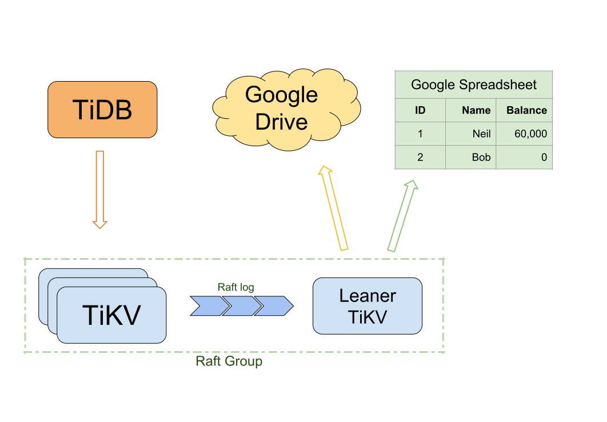
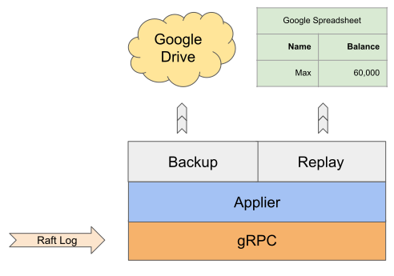

# ToG: Backup and Replay in Real-time

We use Raft Learner to **Backup** TiDB cluster to Google Drive, and **Replay**
it to Google Spreadsheet in real-time.

## Cluster Overview

* Learner TiKV receives Raft log from its leader.

## Architecture

